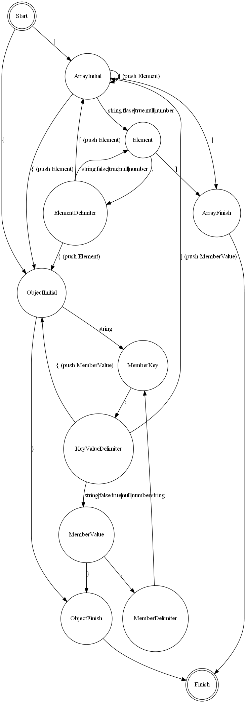

# Internals

This section records some design and implementation details.

[TOC]

# Value {#Value}

## Data Layout {#DataLayout}

## Flags {#Flags}

# Allocator {#Allocator}

## MemoryPoolAllocator {#MemoryPoolAllocator}

# Parsing Optimization {#ParsingOptimization}

## Skip Whitespace with SIMD {#SkipwhitespaceWithSIMD}

## Pow10() {#Pow10}

## Local Stream Copy {#LocalStreamCopy}

# Parser {#Parser}

## Iterative Parser {#IterativeParser}

The iterative parser is a recursive descent LL(1) parser
implemented in a non-recursive manner.

### Grammar {#IterativeParserGrammar}

The grammar used for this parser is based on strict JSON syntax:
~~~~~~~~~~
S -> array | object
array -> [ values ]
object -> { members }
values -> non-empty-values | ε
non-empty-values -> value addition-values
addition-values -> ε | , non-empty-values
members -> non-empty-members | ε
non-empty-members -> member addition-members
addition-members -> ε | , non-empty-members
member -> STRING : value
value -> STRING | NUMBER | NULL | BOOLEAN | object | array
~~~~~~~~~~

Note that left factoring is applied to non-terminals `values` and `members`
to make the grammar be LL(1).

### Parsing Table {#IterativeParserParsingTable}

Based on the grammar, we can construct the FIRST and FOLLOW set.

The FIRST set of non-terminals is listed below:

|    NON-TERMINAL   |               FIRST              |
|:-----------------:|:--------------------------------:|
|       array       |                 [                |
|       object      |                 {                |
|       values      | ε STRING NUMBER NULL BOOLEAN { [ |
|  addition-values  |              ε COMMA             |
|      members      |             ε STRING             |
|  addition-members |              ε COMMA             |
|       member      |              STRING              |
|       value       |  STRING NUMBER NULL BOOLEAN { [  |
|         S         |                [ {               |
| non-empty-members |              STRING              |
|  non-empty-values |  STRING NUMBER NULL BOOLEAN { [  |

The FOLLOW set is listed below:

|    NON-TERMINAL   |  FOLLOW |
|:-----------------:|:-------:|
|         S         |    $    |
|       array       | , $ } ] |
|       object      | , $ } ] |
|       values      |    ]    |
|  non-empty-values |    ]    |
|  addition-values  |    ]    |
|      members      |    }    |
| non-empty-members |    }    |
|  addition-members |    }    |
|       member      |   , }   |
|       value       |  , } ]  |

Finally the parsing table can be constructed from FIRST and FOLLOW set:

|    NON-TERMINAL   |           [           |           {           |          ,          | : | ] | } |          STRING         |         NUMBER        |          NULL         |        BOOLEAN        |
|:-----------------:|:---------------------:|:---------------------:|:-------------------:|:-:|:-:|:-:|:-----------------------:|:---------------------:|:---------------------:|:---------------------:|
|         S         |         array         |         object        |                     |   |   |   |                         |                       |                       |                       |
|       array       |       [ values ]      |                       |                     |   |   |   |                         |                       |                       |                       |
|       object      |                       |      { members }      |                     |   |   |   |                         |                       |                       |                       |
|       values      |    non-empty-values   |    non-empty-values   |                     |   | ε |   |     non-empty-values    |    non-empty-values   |    non-empty-values   |    non-empty-values   |
|  non-empty-values | value addition-values | value addition-values |                     |   |   |   |  value addition-values  | value addition-values | value addition-values | value addition-values |
|  addition-values  |                       |                       |  , non-empty-values |   | ε |   |                         |                       |                       |                       |
|      members      |                       |                       |                     |   |   | ε |    non-empty-members    |                       |                       |                       |
| non-empty-members |                       |                       |                     |   |   |   | member addition-members |                       |                       |                       |
|  addition-members |                       |                       | , non-empty-members |   |   | ε |                         |                       |                       |                       |
|       member      |                       |                       |                     |   |   |   |      STRING : value     |                       |                       |                       |
|       value       |         array         |         object        |                     |   |   |   |          STRING         |         NUMBER        |          NULL         |        BOOLEAN        |

There is a great [tool](http://hackingoff.com/compilers/predict-first-follow-set) for above grammar analysis.

### Implementation {#IterativeParserImplementation}

Based on the parsing table, a direct(or conventional) implementation
that pushes the production body in reverse order
while generating a production could work.

In RapidJSON, several modifications(or adaptations to current design) are made to a direct implementation.

First, the parsing table is encoded in a state machine in RapidJSON.
States are constructed by the head and body of production.
State transitions are constructed by production rules.
Besides, extra states are added for productions involved with `array` and `object`.
In this way the generation of array values or object members would be a single state transition,
rather than several pop/push operations in the direct implementation.
This also makes the estimation of stack size more easier.

The state diagram is shown as follows:

Second, the iterative parser also keeps track of array's value count and object's member count
in its internal stack, which may be different from a conventional implementation.
