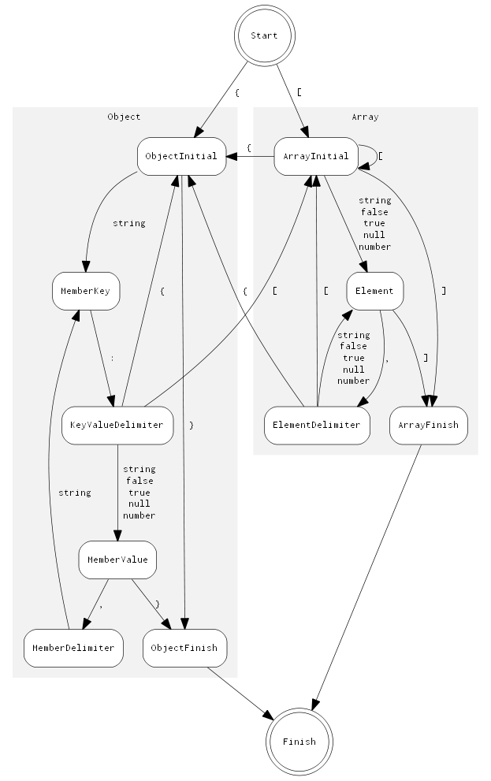

# 内部架构

本部分记录了一些设计和实现细节。

[TOC]

# 架构 {#Architecture}

## SAX 和 DOM

下面的 UML 图显示了 SAX 和 DOM 的基本关系。

关系的核心是 `Handler` 概念。在 SAX 一边，`Reader` 从流解析 JSON 并将事件发送到 `Handler`。`Writer` 实现了 `Handler` 概念，用于处理相同的事件。在 DOM 一边，`Document` 实现了 `Handler` 概念，用于通过这些时间来构建 DOM。`Value` 支持了 `Value::Accept(Handler&)` 函数，它可以将 DOM 转换为事件进行发送。

在这个设计，SAX 是不依赖于 DOM 的。甚至 `Reader` 和 `Writer` 之间也没有依赖。这提供了连接事件发送器和处理器的灵活性。除此之外，`Value` 也是不依赖于 SAX 的。所以，除了将 DOM 序列化为 JSON 之外，用户也可以将其序列化为 XML，或者做任何其他事情。

## 工具类

SAX 和 DOM API 都依赖于3个额外的概念：`Allocator`、`Encoding` 和 `Stream`。它们的继承层次结构如下图所示。

# 值（Value） {#Value}

`Value` （实际上被定义为 `GenericValue<UTF8<>>`）是 DOM API 的核心。本部分描述了它的设计。

## 数据布局 {#DataLayout}

`Value` 是[可变类型](http://en.wikipedia.org/wiki/Variant_type)。在 RapidJSON 的上下文中，一个 `Value` 的实例可以包含6种 JSON 数据类型之一。通过使用 `union` ，这是可能实现的。每一个 `Value` 包含两个成员：`union Data data_` 和 `unsigned flags_`。`flags_` 表明了 JSON 类型，以及附加的信息。

下表显示了所有类型的数据布局。32位/64位列表明了字段所占用的字节数。

| Null              |                                  | 32位 | 64位 |
|-------------------|----------------------------------|:----:|:----:|
| （未使用）        |                                  |4     |8     |
| （未使用）        |                                  |4     |4     |
| （未使用）        |                                  |4     |4     |
| `unsigned flags_` | `kNullType kNullFlag`            |4     |4     |

| Bool              |                                                    | 32位 | 64位 |
|-------------------|----------------------------------------------------|:----:|:----:|
| （未使用）        |                                                    |4     |8     |
| （未使用）        |                                                    |4     |4     |
| （未使用）        |                                                    |4     |4     |
| `unsigned flags_` | `kBoolType` (either `kTrueFlag` or `kFalseFlag`)   |4     |4     |

| String              |                                     | 32位 | 64位 |
|---------------------|-------------------------------------|:----:|:----:|
| `Ch* str`           | 指向字符串的指针（可能拥有所有权）  |4     |8     |
| `SizeType length`   | 字符串长度                          |4     |4     |
| （未使用）          |                                     |4     |4     |
| `unsigned flags_`   | `kStringType kStringFlag ...`       |4     |4     |

| Object              |                                     | 32位 | 64位 |
|---------------------|-------------------------------------|:----:|:----:|
| `Member* members`   | 指向成员数组的指针（拥有所有权）    |4     |8     |
| `SizeType size`     | 成员数量                            |4     |4     |
| `SizeType capacity` | 成员容量                            |4     |4     |
| `unsigned flags_`   | `kObjectType kObjectFlag`           |4     |4     |

| Array               |                                     | 32位 | 64位 |
|---------------------|-------------------------------------|:----:|:----:|
| `Value* values`     | 指向值数组的指针（拥有所有权）      |4     |8     |
| `SizeType size`     | 值数量                              |4     |4     |
| `SizeType capacity` | 值容量                              |4     |4     |
| `unsigned flags_`   | `kArrayType kArrayFlag`             |4     |4     |

| Number (Int)        |                                     | 32位 | 64位 |
|---------------------|-------------------------------------|:----:|:----:|
| `int i`             | 32位有符号整数                      |4     |4     |
| （零填充）          | 0                                   |4     |4     |
| （未使用）          |                                     |4     |8     |
| `unsigned flags_`   | `kNumberType kNumberFlag kIntFlag kInt64Flag ...` |4     |4     |

| Number (UInt)       |                                     | 32位 | 64位 |
|---------------------|-------------------------------------|:----:|:----:|
| `unsigned u`        | 32位无符号整数                      |4     |4     |
| （零填充）          | 0                                   |4     |4     |
| （未使用）          |                                     |4     |8     |
| `unsigned flags_`   | `kNumberType kNumberFlag kUIntFlag kUInt64Flag ...` |4     |4     |

| Number (Int64)      |                                     | 32位 | 64位 |
|---------------------|-------------------------------------|:----:|:----:|
| `int64_t i64`       | 64位有符号整数                      |8     |8     |
| （未使用）          |                                     |4     |8     |
| `unsigned flags_`   | `kNumberType kNumberFlag kInt64Flag ...`          |4     |4     |

| Number (Uint64)     |                                     | 32位 | 64位 |
|---------------------|-------------------------------------|:----:|:----:|
| `uint64_t i64`      | 64位无符号整数                      |8     |8     |
| （未使用）          |                                     |4     |8     |
| `unsigned flags_`   | `kNumberType kNumberFlag kInt64Flag ...`          |4     |4     |

| Number (Double)     |                                     | 32位 | 64位 |
|---------------------|-------------------------------------|:----:|:----:|
| `uint64_t i64`      | 双精度浮点数                        |8     |8     |
| （未使用）          |                                     |4     |8     |
| `unsigned flags_`   |`kNumberType kNumberFlag kDoubleFlag`|4     |4     |

这里有一些需要注意的地方：
* 为了减少在64位架构上的内存消耗，`SizeType` 被定义为 `unsigned` 而不是 `size_t`。
* 32位整数的零填充可能被放在实际类型的前面或后面，这依赖于字节序。这使得它可以将32位整数不经过任何转换就可以解释为64位整数。
* `Int` 永远是 `Int64`，反之不然。

## 标志 {#Flags}

32位的 `flags_` 包含了 JSON 类型和其他信息。如前文中的表所述，每一种 JSON 类型包含了冗余的 `kXXXType` 和 `kXXXFlag`。这个设计是为了优化测试位标志（`IsNumber()`）和获取每一种类型的序列号（`GetType()`）。

字符串有两个可选的标志。`kCopyFlag` 表明这个字符串拥有字符串拷贝的所有权。而 `kInlineStrFlag` 意味着使用了[短字符串优化](#ShortString)。

数字更加复杂一些。对于普通的整数值，它可以包含 `kIntFlag`、`kUintFlag`、 `kInt64Flag` 和/或 `kUint64Flag`，这由整数的范围决定。带有小数或者超过64位所能表达的范围的整数的数字会被存储为带有 `kDoubleFlag` 的 `double`。

## 短字符串优化 {#ShortString}

[Kosta](https://github.com/Kosta-Github) 提供了很棒的短字符串优化。这个优化的xxx如下所述。除去 `flags_` ，`Value` 有12或16字节（对于32位或64位）来存储实际的数据。这为在其内部直接存储短字符串而不是存储字符串的指针创造了可能。对于1字节的字符类型（例如 `char`），它可以在 `Value` 类型内部存储至多11或15个字符的字符串。

|ShortString (Ch=char)|                                     | 32位 | 64位 |
|---------------------|-------------------------------------|:----:|:----:|
| `Ch str[MaxChars]`  | 字符串缓冲区                        |11    |15    |
| `Ch invLength`      | MaxChars - Length                   |1     |1     |
| `unsigned flags_`   | `kStringType kStringFlag ...`       |4     |4     |

这里使用了一项特殊的技术。它存储了 (MaxChars - length) 而不直接存储字符串的长度。这使得存储11个字符并且带有后缀 `\0` 成为可能。

这个优化可以减少字符串拷贝内存占用。它也改善了缓存一致性，并进一步提高了运行时性能。

# 分配器（Allocator） {#InternalAllocator}

`Allocator` 是 RapidJSON 中的概念：
~~~cpp
concept Allocator {
    static const bool kNeedFree;    //!< 表明这个分配器是否需要调用 Free()。

    // 申请内存块。
    // \param size 内存块的大小，以字节记。
    // \returns 指向内存块的指针。
    void* Malloc(size_t size);

    // 调整内存块的大小。
    // \param originalPtr 当前内存块的指针。空指针是被允许的。
    // \param originalSize 当前大小，以字节记。（设计问题：因为有些分配器可能不会记录它，显示的传递它可以节约内存。）
    // \param newSize 新大小，以字节记。
    void* Realloc(void* originalPtr, size_t originalSize, size_t newSize);

    // 释放内存块。
    // \param ptr 指向内存块的指针。空指针是被允许的。
    static void Free(void *ptr);
};
~~~

需要注意的是 `Malloc()` 和 `Realloc()` 是成员函数而 `Free()` 是静态成员函数。

## MemoryPoolAllocator {#MemoryPoolAllocator}

`MemoryPoolAllocator` 是 DOM 的默认内存分配器。它只申请内存而不释放内存。这对于构建 DOM 树非常合适。

在它的内部，它从基础的内存分配器申请内存块（默认为 `CrtAllocator`）并将这些内存块存储为单向链表。当用户请求申请内存，它会遵循下列步骤来申请内存：

1. 如果可用，使用用户提供的缓冲区。（见 [User Buffer section in DOM](doc/dom.md)）
2. 如果用户提供的缓冲区已满，使用当前内存块。
3. 如果当前内存块已满，申请新的内存块。

# 解析优化 {#ParsingOptimization}

## 使用 SIMD 跳过空格 {#SkipwhitespaceWithSIMD}

当从流中解析 JSON 时，解析器需要跳过4种空格字符：

1. 空格 (`U+0020`)
2. 制表符 (`U+000B`)
3. 换行 (`U+000A`)
4. 回车 (`U+000D`)

这是一份简单的实现：
~~~cpp
void SkipWhitespace(InputStream& s) {
    while (s.Peek() == ' ' || s.Peek() == '\n' || s.Peek() == '\r' || s.Peek() == '\t')
        s.Take();
}
~~~

但是，这需要对每个字符进行4次比较以及一些分支。这被发现是一个热点。

为了加速这一处理，RapidJSON 使用 SIMD 来在一次迭代中比较16个字符和4个空格。目前 RapidJSON 只支持 SSE2 和 SSE4.2 指令。同时它也只会对 UTF-8 内存流启用，包括字符串流或 *原位* 解析。

你可以通过在包含 `rapidjson.h` 之前定义 `RAPIDJSON_SSE2` 或 `RAPIDJSON_SSE42` 来启用这个优化。一些编译器可以检测这个设置，如 `perftest.h`：

~~~cpp
// __SSE2__ 和 __SSE4_2__ 可被 gcc、clang 和 Intel 编译器识别：
// 如果支持的话，我们在 gmake 中使用了 -march=native 来启用 -msse2 和 -msse4.2
#if defined(__SSE4_2__)
#  define RAPIDJSON_SSE42
#elif defined(__SSE2__)
#  define RAPIDJSON_SSE2
#endif
~~~

需要注意的是，这是编译期的设置。在不支持这些指令的机器上运行可执行文件会使它崩溃。

### Page boundary issue

In an early version of RapidJSON, [an issue](https://code.google.com/archive/p/rapidjson/issues/104) reported that the `SkipWhitespace_SIMD()` causes crash very rarely (around 1 in 500,000). After investigation, it is suspected that `_mm_loadu_si128()` accessed bytes after `'\0'`, and across a protected page boundary.

In [Intel® 64 and IA-32 Architectures Optimization Reference Manual
](http://www.intel.com/content/www/us/en/architecture-and-technology/64-ia-32-architectures-optimization-manual.html), section 10.2.1:

> To support algorithms requiring unaligned 128-bit SIMD memory accesses, memory buffer allocation by a caller function should consider adding some pad space so that a callee function can safely use the address pointer safely with unaligned 128-bit SIMD memory operations.
> The minimal padding size should be the width of the SIMD register that might be used in conjunction with unaligned SIMD memory access.

This is not feasible as RapidJSON should not enforce such requirement.

To fix this issue, currently the routine process bytes up to the next aligned address. After tha, use aligned read to perform SIMD processing. Also see [#85](https://github.com/miloyip/rapidjson/issues/85).

## Local Stream Copy {#LocalStreamCopy}

During optimization, it is found that some compilers cannot localize some member data access of streams into local variables or registers. Experimental results show that for some stream types, making a copy of the stream and used it in inner-loop can improve performance. For example, the actual (non-SIMD) implementation of `SkipWhitespace()` is implemented as:

~~~cpp
template<typename InputStream>
void SkipWhitespace(InputStream& is) {
    internal::StreamLocalCopy<InputStream> copy(is);
    InputStream& s(copy.s);

    while (s.Peek() == ' ' || s.Peek() == '\n' || s.Peek() == '\r' || s.Peek() == '\t')
        s.Take();
}
~~~

Depending on the traits of stream, `StreamLocalCopy` will make (or not make) a copy of the stream object, use it locally and copy the states of stream back to the original stream.

## Parsing to Double {#ParsingDouble}

Parsing string into `double` is difficult. The standard library function `strtod()` can do the job but it is slow. By default, the parsers use normal precision setting. This has has maximum 3 [ULP](http://en.wikipedia.org/wiki/Unit_in_the_last_place) error and implemented in `internal::StrtodNormalPrecision()`.

When using `kParseFullPrecisionFlag`, the parsers calls `internal::StrtodFullPrecision()` instead, and this function actually implemented 3 versions of conversion methods.
1. [Fast-Path](http://www.exploringbinary.com/fast-path-decimal-to-floating-point-conversion/).
2. Custom DIY-FP implementation as in [double-conversion](https://github.com/floitsch/double-conversion).
3. Big Integer Method as in (Clinger, William D. How to read floating point numbers accurately. Vol. 25. No. 6. ACM, 1990).

If the first conversion methods fail, it will try the second, and so on.

# Generation Optimization {#GenerationOptimization}

## Integer-to-String conversion {#itoa}

The naive algorithm for integer-to-string conversion involves division per each decimal digit. We have implemented various implementations and evaluated them in [itoa-benchmark](https://github.com/miloyip/itoa-benchmark).

Although SSE2 version is the fastest but the difference is minor by comparing to the first running-up `branchlut`. And `branchlut` is pure C++ implementation so we adopt `branchlut` in RapidJSON.

## Double-to-String conversion {#dtoa}

Originally RapidJSON uses `snprintf(..., ..., "%g")`  to achieve double-to-string conversion. This is not accurate as the default precision is 6. Later we also find that this is slow and there is an alternative.

Google's V8 [double-conversion](https://github.com/floitsch/double-conversion
) implemented a newer, fast algorithm called Grisu3 (Loitsch, Florian. "Printing floating-point numbers quickly and accurately with integers." ACM Sigplan Notices 45.6 (2010): 233-243.).

However, since it is not header-only so that we implemented a header-only version of Grisu2. This algorithm guarantees that the result is always accurate. And in most of cases it produces the shortest (optimal) string representation.

The header-only conversion function has been evaluated in [dtoa-benchmark](https://github.com/miloyip/dtoa-benchmark).

# Parser {#Parser}

## Iterative Parser {#IterativeParser}

The iterative parser is a recursive descent LL(1) parser
implemented in a non-recursive manner.

### Grammar {#IterativeParserGrammar}

The grammar used for this parser is based on strict JSON syntax:
~~~~~~~~~~
S -> array | object
array -> [ values ]
object -> { members }
values -> non-empty-values | ε
non-empty-values -> value addition-values
addition-values -> ε | , non-empty-values
members -> non-empty-members | ε
non-empty-members -> member addition-members
addition-members -> ε | , non-empty-members
member -> STRING : value
value -> STRING | NUMBER | NULL | BOOLEAN | object | array
~~~~~~~~~~

Note that left factoring is applied to non-terminals `values` and `members`
to make the grammar be LL(1).

### Parsing Table {#IterativeParserParsingTable}

Based on the grammar, we can construct the FIRST and FOLLOW set.

The FIRST set of non-terminals is listed below:

|    NON-TERMINAL   |               FIRST              |
|:-----------------:|:--------------------------------:|
|       array       |                 [                |
|       object      |                 {                |
|       values      | ε STRING NUMBER NULL BOOLEAN { [ |
|  addition-values  |              ε COMMA             |
|      members      |             ε STRING             |
|  addition-members |              ε COMMA             |
|       member      |              STRING              |
|       value       |  STRING NUMBER NULL BOOLEAN { [  |
|         S         |                [ {               |
| non-empty-members |              STRING              |
|  non-empty-values |  STRING NUMBER NULL BOOLEAN { [  |

The FOLLOW set is listed below:

|    NON-TERMINAL   |  FOLLOW |
|:-----------------:|:-------:|
|         S         |    $    |
|       array       | , $ } ] |
|       object      | , $ } ] |
|       values      |    ]    |
|  non-empty-values |    ]    |
|  addition-values  |    ]    |
|      members      |    }    |
| non-empty-members |    }    |
|  addition-members |    }    |
|       member      |   , }   |
|       value       |  , } ]  |

Finally the parsing table can be constructed from FIRST and FOLLOW set:

|    NON-TERMINAL   |           [           |           {           |          ,          | : | ] | } |          STRING         |         NUMBER        |          NULL         |        BOOLEAN        |
|:-----------------:|:---------------------:|:---------------------:|:-------------------:|:-:|:-:|:-:|:-----------------------:|:---------------------:|:---------------------:|:---------------------:|
|         S         |         array         |         object        |                     |   |   |   |                         |                       |                       |                       |
|       array       |       [ values ]      |                       |                     |   |   |   |                         |                       |                       |                       |
|       object      |                       |      { members }      |                     |   |   |   |                         |                       |                       |                       |
|       values      |    non-empty-values   |    non-empty-values   |                     |   | ε |   |     non-empty-values    |    non-empty-values   |    non-empty-values   |    non-empty-values   |
|  non-empty-values | value addition-values | value addition-values |                     |   |   |   |  value addition-values  | value addition-values | value addition-values | value addition-values |
|  addition-values  |                       |                       |  , non-empty-values |   | ε |   |                         |                       |                       |                       |
|      members      |                       |                       |                     |   |   | ε |    non-empty-members    |                       |                       |                       |
| non-empty-members |                       |                       |                     |   |   |   | member addition-members |                       |                       |                       |
|  addition-members |                       |                       | , non-empty-members |   |   | ε |                         |                       |                       |                       |
|       member      |                       |                       |                     |   |   |   |      STRING : value     |                       |                       |                       |
|       value       |         array         |         object        |                     |   |   |   |          STRING         |         NUMBER        |          NULL         |        BOOLEAN        |

There is a great [tool](http://hackingoff.com/compilers/predict-first-follow-set) for above grammar analysis.

### Implementation {#IterativeParserImplementation}

Based on the parsing table, a direct(or conventional) implementation
that pushes the production body in reverse order
while generating a production could work.

In RapidJSON, several modifications(or adaptations to current design) are made to a direct implementation.

First, the parsing table is encoded in a state machine in RapidJSON.
States are constructed by the head and body of production.
State transitions are constructed by production rules.
Besides, extra states are added for productions involved with `array` and `object`.
In this way the generation of array values or object members would be a single state transition,
rather than several pop/push operations in the direct implementation.
This also makes the estimation of stack size more easier.

The state diagram is shown as follows:

Second, the iterative parser also keeps track of array's value count and object's member count
in its internal stack, which may be different from a conventional implementation.
