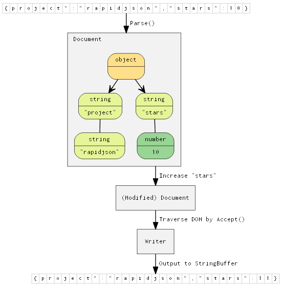

Copyright (c) 2011-2014 Milo Yip (miloyip@gmail.com)

[RapidJSON GitHub](https://github.com/miloyip/rapidjson/)

[RapidJSON Documentation](http://miloyip.github.io/rapidjson/)

## Introduction

RapidJSON is a JSON parser and generator for C++. It was inspired by [RapidXml](http://rapidxml.sourceforge.net/).

* RapidJSON is small but complete. It supports both SAX and DOM style API. The SAX parser is only a half thousand lines of code.

* RapidJSON is fast. Its performance can be comparable to `strlen()`. It also optionally supports SSE2/SSE4.1 for acceleration.

* RapidJSON is self-contained. It does not depend on external libraries such as BOOST. It even does not depend on STL.

* RapidJSON is memory friendly. Each JSON value occupies exactly 16/20 bytes for most 32/64-bit machines (excluding text string). By default it uses a fast memory allocator, and the parser allocates memory compactly during parsing.

* RapidJSON is Unicode friendly. It supports UTF-8, UTF-16, UTF-32 (LE & BE), and their detection, validation and transcoding internally. For example, you can read a UTF-8 file and let RapidJSON transcode the JSON strings into UTF-16 in the DOM. It also supports surrogates and "\u0000" (null character).

More features can be read [here](doc/features.md).

JSON(JavaScript Object Notation) is a light-weight data exchange format. RapidJSON should be in fully compliance with RFC7159/ECMA-404. More information about JSON can be obtained at
* [Introducing JSON](http://json.org/)
* [RFC7159: The JavaScript Object Notation (JSON) Data Interchange Format](http://www.ietf.org/rfc/rfc7159.txt)
* [Standard ECMA-404: The JSON Data Interchange Format](http://www.ecma-international.org/publications/standards/Ecma-404.htm)

## Compatibility

RapidJSON is cross-platform. Some platform/compiler combinations which have been tested are shown as follows.
* Visual C++ 2008/2010/2013 on Windows (32/64-bit)
* GNU C++ 3.8.x on Cygwin
* Clang 3.4 on Mac OS X (32/64-bit) and iOS
* Clang 3.4 on Android NDK

Users can build and run the unit tests on their platform/compiler.

## Installation

RapidJSON is a header-only C++ library. Just copy the `include/rapidjson` folder to system or project's include path.

To build the tests and examples:

1. Execute `git submodule update --init` to get the files of thirdparty submodules (google test).
2. Obtain [premake4](http://industriousone.com/premake/download).
3. Copy premake4 executable to `rapidjson/build` (or system path).
4. Change directory to `rapidjson/build/`, run `premake.bat` on Windows, `premake.sh` on Linux or other platforms.
5. On Windows, build the solution at `rapidjson/build/vs2008/` or `/vs2010/`.
6. On other platforms, run GNU `make` at `rapidjson/build/gmake/` (e.g., `make -f test.make config=release32`; `make -f example.make config=debug32`).
7. On success, the executables are generated at `rapidjson/bin`.

To build the [Doxygen](http://doxygen.org) documentation:

1. Obtain and install [Doxygen](http://doxygen.org/download.html).
2. In the top-level directory, run `doxygen build/Doxyfile`.
3. Browse the generated documentation in `doc/html`.

## Usage at a glance

This simple example parses a JSON string into a document (DOM), make a simple modification of the DOM, and finally stringify the DOM to a JSON string.

~~~~~~~~~~cpp
// rapidjson/example/simpledom/simpledom.cpp`
#include "rapidjson/document.h"
#include "rapidjson/writer.h"
#include "rapidjson/stringbuffer.h"
#include <iostream>

using namespace rapidjson;

int main() {
    // 1. Parse a JSON string into DOM.
    const char* json = "{\"project\":\"rapidjson\",\"stars\":10}";
    Document d;
    d.Parse(json);

    // 2. Modify it by DOM.
    Value& s = d["stars"];
    s.SetInt(s.GetInt() + 1);

    // 3. Stringify the DOM
    StringBuffer buffer;
    Writer<StringBuffer> writer(buffer);
    d.Accept(writer);

    // Output {"project":"rapidjson","stars":11}
    std::cout << buffer.GetString() << std::endl;
    return 0;
}
~~~~~~~~~~

Note that this example did not handle potential errors.

The following diagram shows the process.

More [examples](example/) are available.
